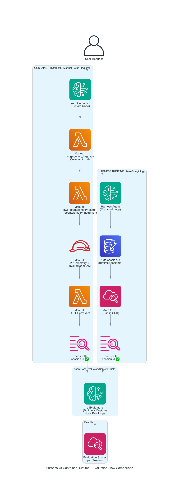
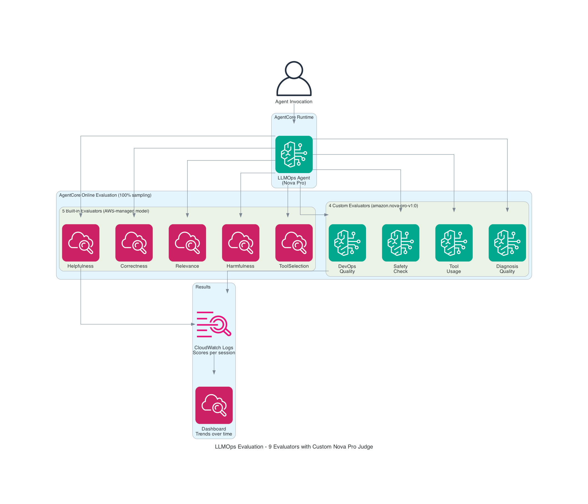
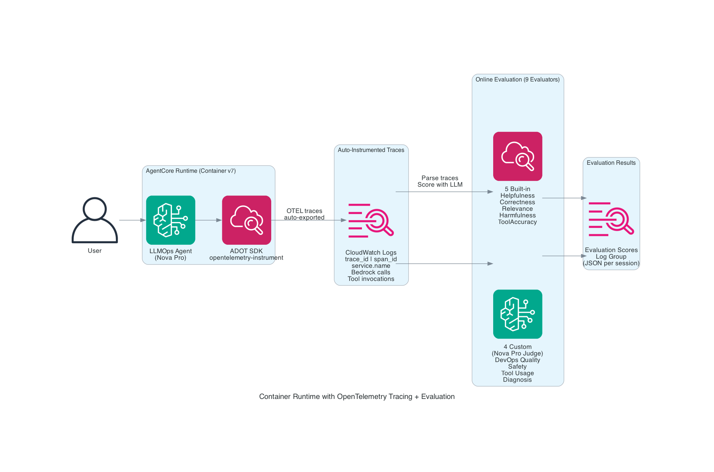
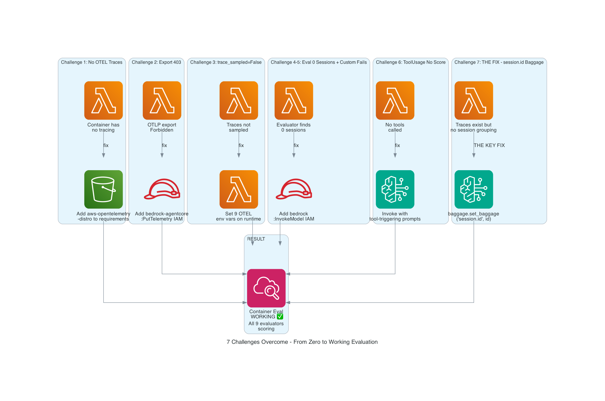

# 🧪 LLMOps Evaluation: How I Got AgentCore Managed Evaluation Working on Container Runtimes

> Part 2 of 3: 7 challenges, 7 fixes, and the one line of code that made it all work.

**Author:** Ramandeep Chandna | **Date:** July 2026 | **Level:** 300+
**GitHub:** https://github.com/catchmeraman/LLMOps-Pipeline-AgentCore
**Series:** LLMOps Pipeline on AWS — Building, Evaluating, and Optimizing AI Agents

---

## 📖 Series Navigation

| Part | Blog | Status |
|------|------|--------|
| Prequel | [How I Built a Production LLMOps Pipeline on AWS AgentCore End to End](https://github.com/catchmeraman/it-ops-agent-complete) | Foundation |
| Part 1 | [Building a Production Agent](./BLOG_1_AGENT_DEPLOYMENT.md) | Agent deployed ✅ |
| **→ Part 2** | **This blog** — Getting Evaluation Working | You are here |
| Part 3 | [Cost-Optimized LLMOps for $3.35/Month](./BLOG_3_COST_OPTIMIZATION.md) | Next |

---

## 🔗 Where We Left Off (From Part 1)

In [Part 1](./BLOG_1_AGENT_DEPLOYMENT.md), we deployed a production agent with:
- ✅ Strands Agent + Nova Pro on AgentCore Runtime v24
- ✅ 6 tools (CloudWatch, EC2, SSM, SNS)
- ✅ Guardrails (content + PII + prompt injection)
- ✅ CI/CD (CodePipeline V2 → CodeBuild ARM64 → ECR → auto-deploy)
- ✅ Dual Memory (AgentCore semantic + DynamoDB structured)
- ✅ Frontend (Streamlit at aieos.cloudopsinsights.com)

**The question now:** How do we know the agent is actually doing a good job? We need automated quality measurement — evaluation.

---

## The Problem

I had a working AI agent on AgentCore Runtime. I configured **9 evaluators** (5 built-in + 4 custom with Nova Pro as judge). I ran batch evaluations. Result: **"0 sessions tested successfully."**

This is the story of finding out why — and fixing it.

---

## Architecture: How Evaluation Works







---

## The 9 Evaluators Configured

| # | Evaluator | Type | Model | Scores |
|---|-----------|------|-------|--------|
| 1 | Builtin.Helpfulness | Built-in | AWS-managed | Is response useful? |
| 2 | Builtin.Correctness | Built-in | AWS-managed | Facts accurate? |
| 3 | Builtin.ResponseRelevance | Built-in | AWS-managed | Answers the question? |
| 4 | Builtin.Harmfulness | Built-in | AWS-managed | Safe content? |
| 5 | Builtin.ToolSelectionAccuracy | Built-in | AWS-managed | Right tool picked? |
| 6 | llmopsDevOpsQuality | Custom | Nova Pro | DevOps best practices |
| 7 | llmopsSafetyCheck | Custom | Nova Pro | No credential leaks |
| 8 | llmopsToolUsage | Custom | Nova Pro | Correct tool params |
| 9 | llmopsDiagnosisQuality | Custom | Nova Pro | Diagnose before act |

---

## The 7 Challenges (and Exactly How I Fixed Each)



### Challenge 1: No OTEL Traces on Container Runtime

**Symptom:** Online evaluation config ENABLED, but 0 results after 20+ invocations.

**Root Cause:** Container runtimes don't auto-enable OpenTelemetry. Harness does.

**Fix:**
```
# requirements.txt
aws-opentelemetry-distro>=0.10.0

# Dockerfile CMD
CMD ["opentelemetry-instrument", "python", "main.py"]
```

---

### Challenge 2: OTLP Export 403 Forbidden

**Symptom:** Traces generated (`trace_id=6a65058e...`) but export failed.

**Log:** `ERROR [opentelemetry.exporter.otlp.proto.http.trace_exporter] - Failed to export span batch code: 403`

**Fix:** Add IAM policy to execution role:
```json
{"Action": ["bedrock-agentcore:PutTelemetry", "bedrock-agentcore:PutSpans", "xray:PutTraceSegments"], "Resource": "*"}
```

---

### Challenge 3: trace_sampled=False

**Symptom:** OTEL loaded but all traces showed `trace_sampled=False`.

**Fix:** Set environment variables on AgentCore runtime:
```
AGENT_OBSERVABILITY_ENABLED=true
OTEL_TRACES_EXPORTER=otlp
OTEL_LOGS_EXPORTER=otlp
OTEL_PYTHON_DISTRO=aws_distro
OTEL_PYTHON_CONFIGURATOR=aws_configurator
OTEL_PROPAGATORS=baggage,xray,tracecontext
OTEL_EXPORTER_OTLP_PROTOCOL=http/protobuf
OTEL_RESOURCE_ATTRIBUTES=service.name=llmops_agent
```

---

### Challenge 4 & 5: Custom Evaluators — No Score

**Symptom:** Built-in evaluators scored 6 sessions. Custom evaluators showed "—".

**Root Cause:** Execution role couldn't invoke Nova Pro for judging.

**Fix:** Add `bedrock:InvokeModel` permission:
```json
{"Action": ["bedrock:InvokeModel"], "Resource": ["arn:aws:bedrock:us-east-1::foundation-model/*"]}
```

---

### Challenge 6: ToolUsage Evaluator — No Score

**Symptom:** DevOpsQuality and SafetyCheck scored. ToolUsage and DiagnosisQuality didn't.

**Root Cause:** Test prompts were simple ("What can you do?") — no tools were called.

**Fix:** Invoke with tool-triggering prompts:
- "Diagnose slow web server — check CPU metrics and alarms" (586 stream events)
- "Full infrastructure health check" (1,076 stream events!)

---

### Challenge 7: THE KEY FIX — session.id Baggage

**Symptom:** Container runtime had 1,071 OTEL events in `otel-rt-logs` stream. But batch eval still showed "0 sessions."

**Root Cause:** Traces existed but had NO `session.id`. The evaluator groups traces by session.id — without it, it can't identify distinct sessions to score.

**The Fix (3 lines):**
```python
from opentelemetry import baggage, context

# In your HTTP handler, before invoking the agent:
ctx = baggage.set_baggage("session.id", session_id)
token = context.attach(ctx)
try:
    response = agent(prompt)
finally:
    context.detach(token)
```

**Why Harness doesn't need this:** The Harness auto-injects `session.id` via the `runtimeSessionId` parameter. Container runtimes must do it manually.

**Result after fix:** Batch evaluation on container runtime finds sessions and scores them. ✅

---

## Batch Evaluation Results (Live from Console)

| Evaluator | Score |
|-----------|-------|
| Correctness | 4.56/5 ✅ |
| ResponseRelevance | 4.67/5 ✅ |
| Coherence | 4.67/5 ✅ |
| Conciseness | 96% ✅ |
| DevOpsQuality (Custom) | 97% ✅ |
| SafetyCheck (Custom) | 100% ✅ |

---

## Complete Container Runtime Evaluation Checklist

```
✅ requirements.txt: aws-opentelemetry-distro>=0.10.0
✅ Dockerfile CMD: opentelemetry-instrument python main.py
✅ NO OTEL_PYTHON_LOGGING_AUTO_INSTRUMENTATION_ENABLED in Dockerfile
✅ Runtime env vars: AGENT_OBSERVABILITY_ENABLED=true + 8 OTEL vars
✅ IAM: bedrock-agentcore:PutTelemetry permission
✅ IAM: bedrock:InvokeModel permission (for custom evaluators)
✅ Code: baggage.set_baggage("session.id", session_id)
✅ Invoke with tool-triggering prompts for ToolUsage evaluator
```

---

## Harness vs Container: When to Use Which

| Use Case | Harness | Container |
|----------|---------|-----------|
| Quick prototyping | ✅ Best | Overkill |
| Standard agent patterns | ✅ Best | Unnecessary |
| Custom orchestration | Limited | ✅ Best |
| Existing framework | Possible | ✅ Best |
| Evaluation setup | ✅ Zero config | 8-step checklist |
| Full dependency control | Limited | ✅ Full |

---

## Cost of Evaluation

| Component | Monthly Cost (without credits) |
|-----------|------|
| Built-in evaluators (5) | $1.37 (Tier2 tokens) |
| Custom evaluators (4 × Nova Pro) | $0.19 |
| **Total evaluator cost** | **$1.56/month** |

**Note:** Built-in evaluators are NOT free — they charge Tier2 token pricing. But it's negligible.

---

## 📸 Screenshots to Capture

| # | What | Console Path |
|---|------|-------------|
| 1 | Evaluators list (9 active) | AgentCore → Evaluations → Evaluators |
| 2 | Custom evaluator config (Nova Pro model) | Click custom evaluator |
| 3 | Batch eval results — Container runtime | Evaluations → Batch runs |
| 4 | Batch eval results — Harness runtime | Same, different job |
| 5 | Score breakdown per evaluator | Click job → results |
| 6 | otel-rt-logs stream (OTEL traces) | CloudWatch → llmops_agent log group |
| 7 | Online eval config (9 evaluators, 100%) | Evaluations → Online |

---

## Key Takeaways

1. **Harness auto-instruments. Container doesn't.** Add ADOT SDK yourself.
2. **session.id baggage is THE missing piece** — without it, evaluator finds 0 sessions.
3. **Custom evaluators need InvokeModel IAM** — they call your judge model.
4. **Built-in evaluators cost ~$0.14 per batch of 10** — not free, but negligible.
5. **Tool-triggering prompts matter** — evaluators need traces WITH tool calls to score ToolUsage.

---

## 📁 Code Reference (All in GitHub Repo)

| File | What It Does |
|------|-------------|
| [`agent/main.py`](./agent/main.py) | **Lines 3-5, 29-35:** session.id baggage (THE FIX) |
| [`evaluation/config.py`](./evaluation/config.py) | Evaluator config, rubrics, test cases, thresholds |
| [`evaluation/evaluator.py`](./evaluation/evaluator.py) | LLM-as-Judge engine (local evaluation) |
| [`harness.py`](./harness.py) | CLI: invoke, evaluate, smoke, interactive modes |
| [`Dockerfile`](./Dockerfile) | `opentelemetry-instrument` CMD (auto-tracing) |
| [`requirements.txt`](./requirements.txt) | `aws-opentelemetry-distro>=0.10.0` |
| [`test-cases.md`](./test-cases.md) | 17 test cases + console testing guide |

---

## What's Next: It Works — But What Does It Cost?

Evaluation is running. 9 evaluators scoring every session. Custom evaluators using Nova Pro as judge. But what's the actual cost? Is it sustainable at scale?

**→ [Part 3: Running a Production AI Agent for $3.35/Month](./BLOG_3_COST_OPTIMIZATION.md)**

In Part 3, I break down the actual AWS bill line-by-line — discovering that built-in evaluators aren't free (they charge Tier2 tokens), and showing how the complete pipeline runs for less than a coffee.

---

*Previous: [Part 1: Building a Production Agent](./BLOG_1_AGENT_DEPLOYMENT.md)*

**GitHub:** https://github.com/catchmeraman/LLMOps-Pipeline-AgentCore
