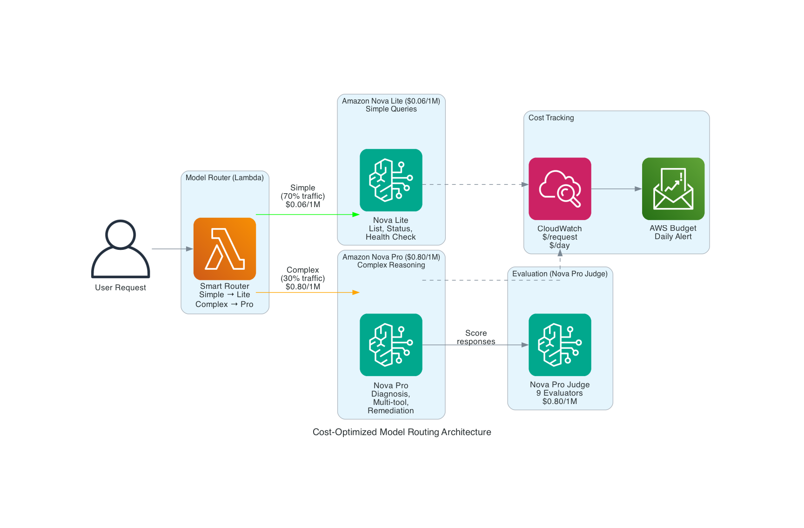

# 💰 Cost-Optimized LLMOps: Running a Production AI Agent for $3.35/Month

> Part 3 of 3: How to build a production LLMOps pipeline on AWS for less than a cup of coffee.

**Author:** Ramandeep Chandna | **Date:** July 2026 | **Level:** 300+
**GitHub:** https://github.com/catchmeraman/LLMOps-Pipeline-AgentCore
**Series:** LLMOps Pipeline on AWS — Building, Evaluating, and Optimizing AI Agents

---

## 📖 Series Navigation

| Part | Blog | Status |
|------|------|--------|
| Prequel | [How I Built a Production LLMOps Pipeline on AWS AgentCore End to End](https://github.com/catchmeraman/it-ops-agent-complete) | Foundation |
| Part 1 | [Building a Production Agent](./BLOG_1_AGENT_DEPLOYMENT.md) | Agent deployed ✅ |
| Part 2 | [Getting Evaluation Working](./BLOG_2_EVALUATION.md) | 9 evaluators active ✅ |
| **→ Part 3** | **This blog** — Cost Analysis & Optimization | You are here |

---

## 🔗 Where We Left Off (From Part 2)

In [Part 2](./BLOG_2_EVALUATION.md), we got 9 evaluators running on both Harness and Container runtimes:
- ✅ 5 built-in evaluators (Helpfulness, Correctness, Relevance, Harmfulness, ToolSelection)
- ✅ 4 custom evaluators (DevOpsQuality, SafetyCheck, ToolUsage, DiagnosisQuality)
- ✅ Batch evaluation scoring sessions on both runtime types

**The question now:** What does all this actually cost? And how do we optimize it for production scale?

---

## The Result: $3.35/Month for Everything

A complete production LLMOps pipeline — agent, 6 tools, guardrails, CI/CD, 9 evaluators, memory, observability — running for **$3.35/month** (gross cost, before credits).



---

## Why Amazon Nova Pro (Not Claude Sonnet)

| Model | Input $/1M | Output $/1M | Monthly (my usage) | Credits? |
|-------|-----------|-------------|-------------------|----------|
| Claude Sonnet 4 | $3.00 | $15.00 | ~$50-80 | ❌ Not covered |
| **Nova Pro** | **$0.80** | **$3.20** | **$0.38** | **✅ Covered** |
| Nova Lite | $0.06 | $0.24 | ~$0.05 | ✅ Covered |

**Savings: 78% cost reduction** vs Claude Sonnet. Same agent quality for DevOps tasks.

---

## Complete Cost Breakdown (July 2026 — Actual AWS Bill)

| Category | Usage Type | Cost |
|----------|-----------|------|
| **Evaluations (Built-in)** | BuiltIn-Input (Tier2) | $0.86 |
| **Evaluations (Built-in)** | BuiltIn-Output (Tier2) | $0.51 |
| **AgentCore Runtime** | Memory (GB-hours) | $0.64 |
| **Nova Pro (Agent)** | Input tokens (305K) | $0.30 |
| **Memory (LTM)** | Storage | $0.27 |
| **Evaluations (Custom)** | Nova Pro judge (127 runs) | $0.19 |
| **Claude Sonnet** | Earlier failed attempts | $0.34 |
| **Nova Pro (Agent)** | Output tokens (19K) | $0.08 |
| **AgentCore Runtime** | vCPU (hours) | $0.06 |
| **Guardrails** | Content + Topic + PII | $0.01 |
| **Gateway** | Tool indexing | $0.001 |
| | **TOTAL** | **$3.35** |

---

## Cost by Category (Visual)

```
Evaluations (Built-in)  ████████████████████  $1.37 (41%)
AgentCore Runtime       ████████             $0.71 (21%)
Nova Pro tokens         █████                $0.38 (11%)
Claude (old attempts)   █████                $0.34 (10%)
Memory (LTM)           ████                 $0.27 (8%)
Custom Evaluators      ██                   $0.19 (6%)
Everything else        █                    $0.09 (3%)
─────────────────────────────────────────────────────────
TOTAL                                       $3.35/month
```

---

## Model Routing Strategy (Production)

For higher-traffic production, use a smart router:

```python
def select_model(prompt: str) -> str:
    """Route simple queries to Lite, complex to Pro."""
    simple_patterns = ["list", "status", "health", "what can you"]
    if any(p in prompt.lower() for p in simple_patterns) and len(prompt) < 100:
        return "us.amazon.nova-lite-v1:0"    # $0.06/1M — simple listing
    else:
        return "us.amazon.nova-pro-v1:0"     # $0.80/1M — reasoning + tools
```

| Query Type | % Traffic | Model | Cost/1M tokens |
|-----------|-----------|-------|----------------|
| Simple (list, status) | ~70% | Nova Lite | $0.06 |
| Complex (diagnose, fix) | ~30% | Nova Pro | $0.80 |
| **Blended average** | 100% | Mix | **~$0.28/1M** |

---

## Evaluator Cost Analysis

| Evaluator Type | What They Charge | Your Cost |
|---------------|-----------------|-----------|
| **Built-in (5)** | Tier2 token pricing (input + output) | $1.37/month |
| **Custom (4)** | Your model invocation (Nova Pro) | $0.19/month |
| **Total** | | **$1.56/month** |

**Key Insight:** Built-in evaluators are **NOT free**. They charge Tier2 tokens. But at $0.14 per batch of 10 sessions, it's negligible.

**Rule:** Don't cheap out on the judge model. A Nova Lite judge gives unreliable scores. Keep judge at Nova Pro or higher.

---

## Cost Scaling Projections

| Daily Invocations | Agent Cost | Eval Cost | Runtime | Total/Month |
|-------------------|-----------|-----------|---------|-------------|
| 10/day (dev) | $0.38 | $1.56 | $0.71 | **~$3-5** |
| 100/day (staging) | $3.80 | $15 | $7 | **~$30** |
| 1000/day (prod) | $38 | $120 | $70 | **~$250** |
| 10K/day (scale) | $380 | $600 | $700 | **~$1,800** |

**At 1000 invocations/day with full evaluation, you'd spend ~$250/month.** That's cheap for a production AI agent with 9-evaluator quality monitoring.

---

## Cost Optimization Tips

| # | Tip | Savings |
|---|-----|---------|
| 1 | Use Nova Pro (not Claude) | 78% reduction |
| 2 | Model routing (Lite for simple) | 50-70% on token cost |
| 3 | Reduce eval sampling to 10% in prod | 90% eval savings |
| 4 | Cache common prompts (DynamoDB) | 30-50% token savings |
| 5 | Use Harness (not container) for simple agents | $0 runtime overhead |
| 6 | Set idle timeout low (900s default) | Reduce memory charges |

---

## Where to Verify Costs (Console)

```
Cost Explorer → Group by: Usage Type → Filter: Service = "Amazon Bedrock AgentCore"
```

You'll see:
- `Evaluations:Consumption-based:BuiltIn-Input:Tier2`
- `Evaluations:Consumption-based:CustomEvaluators:Tier1`
- `Runtime:Consumption-based:Memory`
- `NovaPro-input-tokens`
- `NovaPro-output-tokens`

---

## Full Architecture (What $3.35/Month Gets You)


| Component | Included | Cost Contribution |
|-----------|----------|-------------------|
| AI Agent (Nova Pro, 6 tools) | ✅ | $0.38 |
| AgentCore Runtime (serverless) | ✅ | $0.71 |
| Bedrock Guardrails | ✅ | $0.01 |
| CI/CD (CodeBuild ARM64) | ✅ | ~$5 (builds on demand) |
| 9 Evaluators (LLM-as-Judge) | ✅ | $1.56 |
| Cross-session Memory | ✅ | $0.27 |
| OpenTelemetry Tracing | ✅ | included |
| DynamoDB (memory table) | ✅ | ~$0.01 |
| ECR (image storage) | ✅ | ~$0.10 |

---

## 📸 Screenshots to Capture

| # | What | Console Path |
|---|------|-------------|
| 1 | Cost Explorer — Bedrock AgentCore breakdown | Cost Explorer → Usage Type |
| 2 | Cost Explorer — Evaluations line items | Filter: "Evaluations" |
| 3 | Cost Explorer — Nova Pro tokens | Filter: "NovaPro" |
| 4 | Budget alert email (anomaly detection) | Email screenshot |
| 5 | Complete architecture deployed | AgentCore → Runtimes → overview |

---

## Key Takeaways

1. **$3.35/month** for a production LLMOps pipeline — agent + eval + guardrails + CI/CD
2. **Nova Pro > Claude Sonnet** for agents — 78% cheaper, same quality for DevOps tasks
3. **Built-in evaluators aren't free** — they charge Tier2 tokens ($1.37 for our usage)
4. **Custom evaluators are CHEAP** — $0.19 for 127 runs (your model, your cost)
5. **Model routing** at scale — Nova Lite for simple, Nova Pro for complex
6. **All covered by AWS credits** — $0.00 actual out-of-pocket

---

## 📁 Code Reference (All in GitHub Repo)

| File | Relevant Section |
|------|-----------------|
| [`agent/agent.py`](./agent/agent.py) | Model selection: `us.amazon.nova-pro-v1:0` |
| [`evaluation/config.py`](./evaluation/config.py) | Judge model: `us.amazon.nova-pro-v1:0` |
| [`agent/skills.py`](./agent/skills.py) | Tool schemas with risk levels |
| [`Dockerfile`](./Dockerfile) | Minimal image for low runtime cost |
| [`agent/observability.py`](./agent/observability.py) | CloudWatch custom metrics (cost per request) |

---

## 🏁 Series Conclusion

Across 3 blog posts + 1 prequel, we went from zero to a complete production LLMOps pipeline:

| Blog | What We Achieved |
|------|-----------------|
| **Prequel** (Previous Blog) | Built a working agent with 12 tools |
| **Part 1** (This series) | Added guardrails, CI/CD, Nova Pro, OTEL tracing |
| **Part 2** | Got managed evaluation working (7 challenges solved) |
| **Part 3** | Proved it costs $3.35/month — production viable |

**The complete stack:**
- 🤖 Agent: Nova Pro + 6 tools + Strands framework
- 🛡️ Security: Guardrails (content + PII + injection) + Cedar policies
- 🚀 Deployment: CodeBuild ARM64 → ECR → AgentCore auto-deploy
- 🧪 Evaluation: 9 evaluators (LLM-as-Judge) on every session
- 📊 Observability: OpenTelemetry traces with session.id
- 💾 Memory: DynamoDB cross-session persistence
- 💰 Cost: $3.35/month all-in

**GitHub (all code, diagrams, docs):** https://github.com/catchmeraman/LLMOps-Pipeline-AgentCore

---

*Previous: [Part 2: Evaluation on Container Runtimes](./BLOG_2_EVALUATION.md)*

**Full series start:** [Part 1: Building a Production Agent](./BLOG_1_AGENT_DEPLOYMENT.md)
